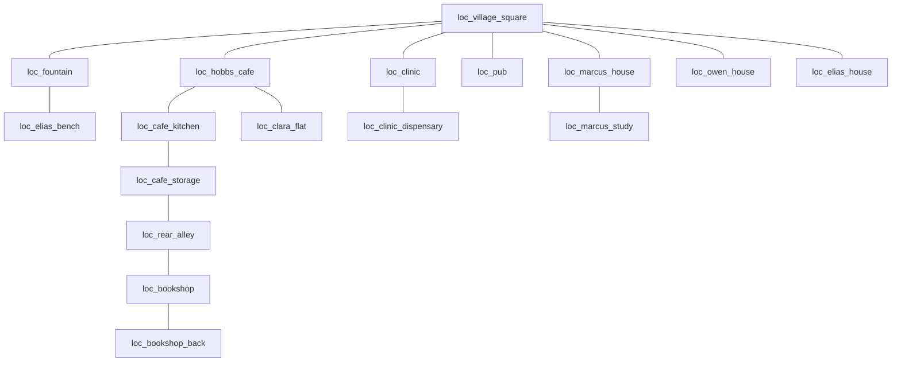

# Canonical Town Layout

Status: implemented visual layout contract for the 192×144 overhead world.

The saved map-editor output at `backend/app/data/town/town_layout.json` is the authoritative source
for location bounds, object anchors, lights, and case overrides. This document explains that data;
it does not replace it.

## Scope

This layout is used by overhead Map Replay, Rewind, crops, and map-based transitions. It does not
define the camera or composition of Places investigations. Those use dedicated cinematic artwork
under `docs/scene_asset_bible.md`.

## Grid and image contract

- World: 192 columns × 144 rows.
- Logical tile: 32px.
- Rendered world: 6144×4608.
- Mosaic: 3 columns × 3 rows.
- Each mosaic cell: 64×48 logical tiles, rendered at 2048×1536.
- Origin: north-west of the full world.
- B2 is the centre cell containing the core village.
- Canonical bounds are full-world coordinates. Do not treat them as B2-local coordinates.

The runtime defaults are defined in `backend/app/town_map.py`:

- directory: `/art/town/tiles_3x3_hd/current_village_v2_neutral/`
- full image: `town_overworld_full_current_village_v2_neutral.avif`
- B2 exterior: `town_overworld_B2_current_village_v2_neutral.avif`
- B2 cutaway: `town_overworld_B2_current_village_v2_neutral_cutaway.avif`
- close-view threshold: `3.2`

`frontend/src/map/mapAssets.ts` resolves single images, mosaics, and close-zoom swaps.

The 32px value is a coordinate system, not a pixel-art mandate. Primary map artwork must remain a
continuous high-resolution painted environment without visible RPG tile repetition. Legacy
character sheets are temporary moving-agent markers only.

## Current runtime selection

`CASE_MAPS` in `backend/app/town_map.py` is authoritative:

| Case | Current map mode |
|---|---|
| `case_001` | authored shared HD village with matched cutaway |
| `case_002` | canonical 3×3 overworld |
| `case_003` | authored afternoon case map |
| `case_004` | canonical 3×3 overworld |
| `case_005` | authored rear-alley/dawn case map |
| `case_006` | authored night case map |
| `case_007` | authored lantern-fair case map |
| `case_010` | authored shared HD village with matched cutaway |

There is no longer a valid blanket statement that all cases except Case 004 use `the_ville`.

## Canonical geography

The saved layout contains 29 canonical locations. The exact current bounds are reproduced in
`town_asset_bible.md`; read them from `town_layout.json` in code and tools.

The core relationships remain:

This is a visual relationship guide. It must not silently replace case
`connected_location_ids`, access rules, event movement, or clue logic.

Peripheral canonical zones include the lake, woodland, meadow, fishery, back lane, St Alder Church,
and Willow Farmhouse. Their large full-world bounds are intentional and should not be squeezed into
the old centre-cell footprint.

## Saved editor data

Current `town_layout.json` uses schema `town_layout_editor_v2` and contains:

- 29 canonical locations;
- 11 local light definitions;
- case override blocks for Cases 001–007;
- object anchors for each of those case override blocks;
- no canonical `building_instances`;
- no canonical `prop_instances`;
- no canonical sprite-sheet ambience placements;
- no per-case location overrides or overlay placements.

The empty collections are valid current state, not evidence that old draft coordinates should be
restored. Building and prop libraries remain available to the editor for future placements.

## Evidence and object anchors

Object anchors use full-world tile coordinates and remain independent from painted evidence.
`render_policy: discovery_gated` means the marker or semantic overlay cannot appear merely because
the location is visible.

Case 004 currently has nine anchors:

- fountain coping stone;
- muddy bootprint;
- Fred’s lighter;
- Owen’s receipt;
- pub ledger;
- blackmail letters;
- arson clipping;
- Ben’s phone;
- mud on Ben’s jacket.

Only discovered evidence has `safe_to_render: true`. Truth replay and accusation resolution remain
separate projections.

## Map layers and lighting

The canonical world provides geometry. Runtime layers may add:

- close-zoom cutaway imagery;
- local time-gated lights;
- case damage/state overlays;
- discovery-gated object markers;
- agent/event markers;
- fog or reveal treatment;
- ambient effects.

Global time of day stays code-driven through `lightingTint(minutesOfDay)`. Local windows, lamps, and
fireplaces are accents, not baked global grading.

## Places and forensic scenes

Map crops are not acceptable final Places artwork when a dedicated scene exists. `sceneArt.ts`
selects location-specific HD frames, while specialist components may add 2.5D navigation and
forensic states. The Cafe Storage Room is the current interactive reference.

Never upscale a building stamp, tile cell, low-resolution character asset, or evidence glyph to make a Places scene.

## Change procedure

When the map editor changes the layout:

1. save `town_layout.json`;
2. validate the payload;
3. update the bounds table in `town_asset_bible.md`;
4. synchronize `town_canonical_v1_manifest.json`;
5. verify external and cutaway tiles use identical geometry;
6. inspect map crops and light overlays;
7. do not alter case logic to compensate for art.
