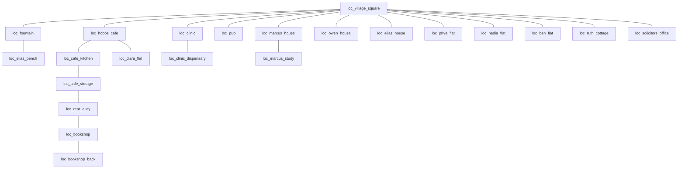

# Canonical Town Layout

Status: proposed visual layout; existing runtime coordinates remain unchanged until a later implementation pass.

Implementation note: Case 004 is the first migrated consumer. Its runtime map response uses `town_canonical_v1` dimensions and an explicitly documented temporary source-image transform so the pilot bounds match the current daylight reference artwork. The canonical tile coordinates remain the target layout; unmigrated cases retain the legacy `the_ville` definition and fallback placement.

The Case 004 visual contract includes `visual.object_visuals`. Object anchors are image-space points derived from the pilot bounds, while their semantic IDs remain independent of the temporary raster image. Fog/location visibility can produce `hidden` or `visible` object states, but only `discovered` objects have `safe_to_render: true` and an active evidence marker.

## Grid contract

- Canvas: 64 columns x 48 rows, 32px logical tiles, 2048x1536 source canvas.
- Origin: `(0,0)` is north-west; x increases east, y increases south.
- Coordinates in this document are canonical recommendations, not authoritative case data.
- The fountain square is the navigation anchor at approximately `(32,22)`.
- The populated town occupies roughly x=6..58 and y=3..43. The outer four-tile perimeter is reserved for trees, roads, fog, and future expansion.
- Buildings are roofless/opened for investigation views. Exterior walls, doors, and windows remain visible in a cutaway footprint.

## Layout sketch

```text
NORTH
  expansion woods / north road
  [Marcus House + Study] [Hobbs Cafe + Kitchen + Storage] [Clinic + Dispensary]
  [Bookshop + Back Room] == rear alley/service lane == [Owen House + Yard]
                 \          Village Square          /
                  \      Fountain + benches       /
       [Mallet & Crown] ---- paths / lamps ---- [Elias Cottage]
  [Ben Flat] [Priya Flat] [Nadia Flat] [Ruth Cottage + Garden]
              [Whittle & Cross] -- south road / expansion
SOUTH
```

The sketch is a connectivity guide, not a pixel-art construction image. The alley must be visibly distinct from the square and connect cafe/bookshop rear doors. Houses and flats can be visually adjacent while preserving separate location IDs.

## Recommended footprints

| Location ID | Footprint x,y,w,h | Interior zones |
|---|---:|---|
| `loc_village_square` | 18,14,28,16 | plaza, fountain island, benches, flowerbeds, lamp nodes |
| `loc_fountain` | 29,19,10,9 | water basin, coping ring, east coping evidence anchor, flowerbed |
| `loc_marcus_house` | 28,5,11,8 | sitting room, kitchen corner, front step |
| `loc_marcus_study` | 31,7,8,6 | desk, book wall, fireplace, document anchors |
| `loc_hobbs_cafe` | 18,7,11,8 | public tables/counter, till, kitchen threshold |
| `loc_cafe_kitchen` | 20,12,5,5 | sink, coat rack, mop bucket |
| `loc_cafe_storage` | 25,12,5,5 | crates, ledger storage, rear door |
| `loc_clinic` | 39,15,9,8 | waiting room, reception, bed/treatment area |
| `loc_clinic_dispensary` | 45,16,6,6 | cabinet, shelves, preparation sink, log |
| `loc_bookshop` | 10,9,10,8 | shelves, counter, front door, rear access |
| `loc_bookshop_back` | 10,13,10,6 | desk, safe, stock shelves, broken window, rear door |
| `loc_rear_alley` | 22,5,20,4 | cafe rear door, bookshop rear door, bins, crates, fire zone |
| `loc_pub` | 9,6,11,10 | bar, stools, tables, ledger anchor |
| `loc_owen_house` | 47,13,11,10 | house, gate, timber yard, boot/belt evidence anchors |
| `loc_elias_house` | 24,31,8,7 | cottage rooms, bedroom window facing fountain |
| `loc_clara_flat` | 19,3,7,5 | bed, small table, documents/phone |
| `loc_ben_flat` | 5,24,7,5 | sitting/bed area, phone, letters, jacket |
| `loc_priya_flat` | 6,29,7,5 | living space, books, scarf |
| `loc_nadia_flat` | 40,10,6,5 | living room/window sightline |
| `loc_ruth_cottage` | 48,29,11,9 | cottage, fireplace, fenced foxglove garden |
| `loc_solicitors_office` | 42,37,9,6 | reception, desk, document storage |
| `loc_elias_bench` | 31,22,4,2 | bench sub-zone beside fountain |

## Adjacency graph



This graph is a visual/navigation recommendation. It must not silently replace `connected_location_ids` or access rules in case data. A later migration can add a location-to-canonical-transform table so old case coordinates remain valid while the renderer uses canonical bounds.

## Case visibility overlays

| Case | Initial reveal | Important overlays |
|---|---|---|
| 001 | square, cafe, kitchen, storage, alley, bookshop, clinic, Marcus/Owen houses, Clara flat, fountain | till weight moved to mop bucket, rear-door state, storage evidence |
| 002 | square, bookshop/back room, alley, cafe, clinic, Owen house, Priya flat, fountain | broken window/glass, safe/back-panel state, scarf thread, document anchors |
| 003 | square, clinic/dispensary, fountain/bench, cafe, Owen house, Clara flat | dispensary access, altered log, pill organiser, collapsed bench state |
| 004 | square/fountain, pub, clinic sightline, Elias cottage, Owen house, Priya/Ben flats | missing coping, muddy flowerbed/bootprint, night tint, pub lighter, blackmail documents |
| 005 | square, alley, cafe, Clara flat, Owen house, clinic, bookshop, fountain | fire/ash/scorch, bins/crates, belt, property papers |
| 006 | square, Marcus house/study, Ruth cottage/garden, bookshop, clinic, solicitor, Priya flat | fireplace ash, foxglove harvest, cocoa residue, will/document states |

Fog must reveal only locations relevant to the case or already public through the existing game flow. It must not reveal hidden events or clue markers merely because a location is visible.

## Existing-coordinate migration

Current case-001 and case-004 coordinates are image-pixel positions on different images. Cases 002, 003, 005, and 006 have no authored coordinates. Do not overwrite those values during this design pass. Later implementation should add an explicit `map_asset_version`/canonical transform layer, preferably returning both:

```json
{
  "map": {"asset": "town_canonical_v1", "width": 2048, "height": 1536, "tile_size": 32, "grid": {"cols": 64, "rows": 48}},
  "locations": [{"location_id": "loc_fountain", "canonical_bounds": {"x": 928, "y": 608, "width": 320, "height": 288}, "legacy_position": null}]
}
```

The renderer should prefer `canonical_bounds` when the canonical asset is selected and retain legacy fields for compatibility/fallback.
